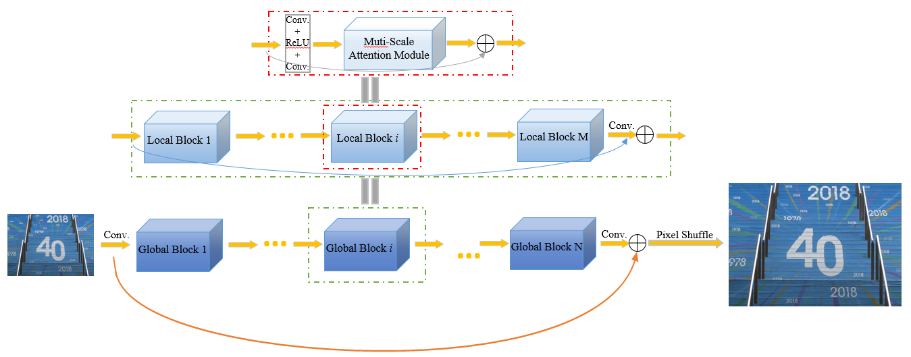
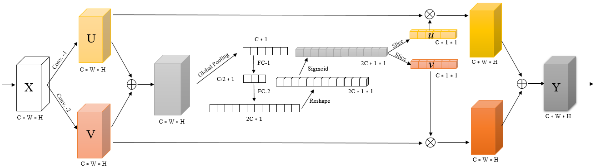
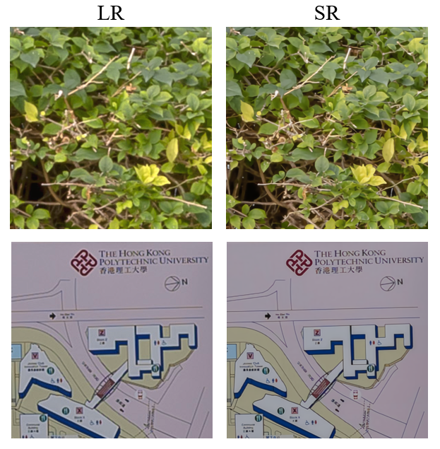

# ERCAN for NTIRE2019-Super-Resolution
PyTorch implementation of "Enhanced Residual Attention Network for Single Image Super-Resolution".
Code&Model url: https://drive.google.com/open?id=17MEe5NrpmZZAkO_YFREUFjPAeB9XfEGf

The code is built on EDSR (PyTorch) and tested on Ubuntu 16.04 environment.

## Contribution
### **Main Contributions the proposed method:**
* Low-resolution images downsampled to half(2x) for sharper edge and
more detail information. Input small images can also increase the speed
of the network reconstructed image.
* Introducing the idea of multi-scale channel attention into our model,
compared to the previous channel attention mechanism, our method can
learn a richer inter-channel relationship, thereby improving network performance.
* Employing self-ensemble, RGB sub-mean to improve the quality of the
reconstructed image.

## Dependencies
* Python 3
* PyTorch >= 1.0.0
* numpy
* skimage
* **imageio**
* matplotlib
* tqdm

## Train
### Prepare training data

1. Download NTIRE2019 training data (60 training + 20 validation images)

2. Downsize(2x) these training data by bicubic (**We already prepare these images in our source code**)

3. Specify '--dir_data' based on the HR and LR images path. In option.py, '--ext' is set as 'sep_reset', which first convert .png to .npy. If all the training images (.png) are converted to .npy files, then set '--ext sep' to skip converting files.

For more informaiton, please refer to [EDSR(PyTorch)](https://github.com/thstkdgus35/EDSR-PyTorch).

### Begin to train

 ```bash
    # Train our ERCAN model
    cd src
    python3 main.py --model ERCAN --save ERCAN
 ```


## Test(Quick start)
 ```bash
    # Test our trained ERCAN model
    cd to src
    sh demo.sh
 ```

## Architecture
### Network Architecture

### Multi-scale Attention Module


## Results


## References :
```
@InProceedings{EDSR,
  author    = {Bee Lim and Sanghyun Son},
  title     = {Enhanced Deep Residual Networks for Single Image Super-Resolution},
  booktitle = {CVPR Workshops},
  year      = {2017}
}

@InProceedings{RCAN,
  author    = {Yulun Zhang and Kunpeng Li},
  title     = {Image Super-Resolution Using Very Deep Residual Channel Attention Networks},
  booktitle = {ECCV},
  year      = {2018}
}

@InProceedings{SKN,
  author    = {Xiang Li and Wenhai Wang},
  title     = {Selective Kernel Networks},
  booktitle = {CVPR},
  year      = {2019}
}
```